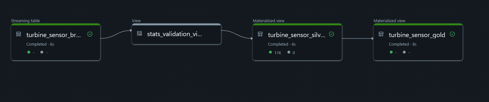
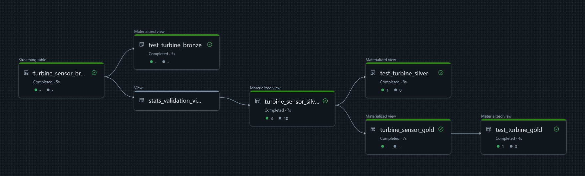

# Turbine

## Overview
Pipeline to ingest and transform the sensor data

Uses a medallion multihop approach with Delta Live Tables (DLT).
Python functions are provided to the pipeline to allow for isolation of functionality and testing

* load_data.py loads the raw data from the cloud location into the Bronze table
* clean_data.py creates the standard deviation of the data set and tests the data quality before loading to Silver tables
* publish_data.py aggregates the data and creates a summary view of the data by turbine id and date

### Assumptions
Architectural
1. MVP assumes a single workspace
2. Requires UC
3. Uses serverless
   
Functional
1. Wind direction assumed to be in degress (0-359)
2. Standard deviation global for all turbines, not by turbine
3. Standard deviation updated to use last 30 days only
4. Nulls and negative values not allowed. No data imputation used at this stage

### Decisions
1. DLT and Autoloader chosen to simplify the pipelines and abstract most the potential complexity. Matches the requirement to load data from an append only source
2. Test pipeline rather than unit tests. In order to validate a sample data set
3. Use serverless for initial deployment. Can gather data on the efficiency and adjust later if required

## Installation
Running setup.py will add the required locations to the schema and create a test data set written to csv.
Test data is stored and processed in a separate schema to isolate from production workloads
2 Pipelines are included. 
1. turbine sensor - the production pipeline
2. turbine sensor test pipeline - uses the test locations and additional views with expectations to check the functions are correct

Use bundle deploy to install the code

## Testing
3 additional tables are created to check the pipeline processes the test data set correctly

* test_turbine_bronze
* test_turbine_silver
* test_turbine_gold

Expectations are used on the test tables to ensure the correct number of records have been filtered at each stage.

## Next Steps
Steps to bring to production
1. Align with target architecture and environments
2. Review ACLs in production environment
   
Further steps to discuss to bring additional benefits from the data
1. Create monitoring dashboard
2. Custom monitoring with webhooks may beneficial to client if required
3. Refactor to use portable expectations, stored in table
4. Investigation using moving averages to better understand fluctuations
5. Investigation to use regression model (wind speed, wind direction ~ power output) to enable forecasting
6.  Additional monitoring to isolate persistant failures of particular sensor or turbine
7.  Validate pipelines and tests against additional data sets